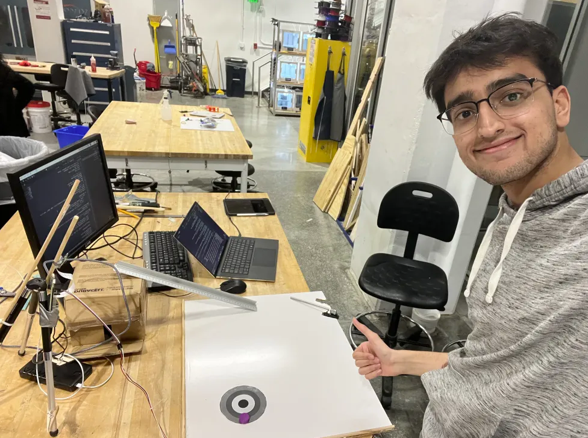

# Swa-Flow
*Servo that learns to hit the bullseye using CV*


## Overview

The goal is to train the servo to accurately strike a disc toward a target. After each attempt, the camera captures the disc’s landing position, and the vision model evaluates the accuracy. Based on the result, the system automatically adjusts power and timing until it consistently hits the target—typically within six attempts.




---


## 🎯 Demo

| Progress Over Time | Final Target Hit |
|--------------------|------------------|
|  |  |

A video showing the Final Target Hit in the above chain:

[](https://youtube.com/shorts/3_GFVGlN-MU)

And the system works even if the target is in another location:


---

## Physical Setup

### Components
- **Raspberry Pi 4 Model B**
- **Raspberry Pi V2 Camera**
- **Continuous Servo** (a positional servo is probably better)
- **Ramp-based release** (e.g. ruler or slide or ramp)
- **Basic building materials:** wood, tape, zip ties
- **Second computer** for faster inference

---

### Build Montage :)

| Cutting the Frame (I felt very cool) | Mounting the Camera  | Build some kind of Paddle (1st prototype) |
|---------------|------------------|---------------|
|  |  |  |

| Release Ramp (Ideally create a deterministic release) | Camera Working!!! | Raspberry Pi Server Online!!! |
|--------------|----------------|------------------|
|  |  |  |

Initially, I wanted to run everything on the Raspberry Pi. But after some trial and error, I decided to run a flask server and stream the camera output to my laptop. I then ran inference on my laptop and sent the servo settings back to the Raspberry Pi to execute.

---

## Computer Vision

Trained using Roboflow (https://universe.roboflow.com/swahaha/swa-flow/model/2) to detect the disc and the target.

### Training Summary
- I took 120 images, augmented to over 250 using small rotations and blur
- Fine-tuned **Roboflow 3.0 (Fast)** model from COCOn checkpoint
- Adjusted preprocessing to scale (not crop) input images
- Ended up achieving very good precision despite the small dataset

I really liked using Roboflow’s AI annotation system, especially the Box Prompting tool that kept improving as I used it. 

| Dataset Information | Model Training Graphs |
|--------------------|------------------|
|  |  |

---

## Code Structure

### Raspberry Pi (Flask Server)
- Streams camera frames via `/video_feed`
- Accepts launch commands via `/run-servo`

```python
@app.route('/run-servo', methods=['POST'])
def run_servo():
    pw = float(request.get_json().get("pw", 0))
    delay = float(request.get_json().get("delay", 0))
    time.sleep(delay)
    pwm.ChangeDutyCycle(pw)
    time.sleep(0.3)
    pwm.ChangeDutyCycle(0)
    return {"status": "triggered"}
```

---

### Laptop (Inference + Feedback GUI)
- Captures live stream from Pi
- Runs object detection 

```python
model = get_model("swa-flow/2", api_key=":)")
# Pull a frame from video stream at inference time
result = model.infer(frame, confidence=0.5)
```

- Calculates distance from target (displayed as score)
- Sends feedback to adjust:
  - **Delay** (timing of launch)
  - **Pulse Width** (servo power)

#### Feedback Logic

```python
# 50 is arbitrary for my specific build dimensions
if distance < 50:
    instruction = "Hit correctly"
elif x_d <= x_t and y_d < y_t - 50:
    instruction = "Hit earlier"
elif x_d > x_t + 50 and y_d >= y_t:
    instruction = "Hit later"
elif x_d > x_t and y_d < y_t:
    instruction = "Hit harder"
elif x_d < x_t and y_d > y_t:
    instruction = "Hit softer"
```

And each of these correspond to a change in servo settings, for instance, "Hit harder" reduces the pw setting by 0.2 (lower pw corresponds to faster servo rotation). "Hit earlier" triggers the servo 0.05 seconds earlier. At first, I was trying to use a fancier algorithm, but this much simpler idea just worked.

---

## Notes on Servo Calibration (If Continuous)

My servo was miscalibrated, so I manually computed the following control pw values:
- 0 = stop
- 0–1.415 ms = clockwise (slower as it approaches 1.415)
- 1.415 ms + = counter-clockwise (not used)

Use this script to test:

```python
pw = float(input("Enter speed: "))
duration = float(input("Duration: "))
set_servo_duty_cycle(pw)
time.sleep(duration)
set_servo_duty_cycle(0)
```

---

## Results and Future Improvements

- Reliable convergence in <7 attempts
- Works with random target placement

By far the biggest improvement would be to automate the release mechanism. This would make the system more deterministic. Using a positional servo instead of a continuous servo would also be a good change. Finally, we could update the CV pipeline to detect the board corners (e.g. with corner stickers) for spatial calibration. This would enable gradient based servo adjustements instead of the current categorical form of feedback ("hit harder" or "hit later").

---
